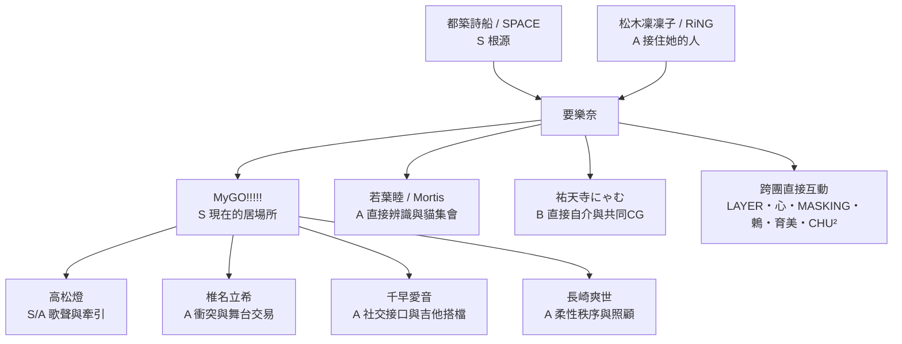

# 要樂奈完整人物關係圖

## 分級

| 級別 | 定義 |
|---|---|
| S | 人生根源、明確選擇的居場所或最高核心牽引 |
| A | 多次直接互動，對行動、演奏或自我認知有實質影響 |
| B | 有正式獨立故事、共同 CG、共同演奏或明確相識 |
| C | 有短直接對話、對方明確認識她或互動索引可驗證 |
| D | 只同場、團體合照、被提及或間接知道 |
| U | 目前沒有可驗證互動；不能捏造 |

## 核心圖

## MyGO!!!!!

### 高松燈 — S/A

**證據主軸**

- 動畫中，燈的歌詞與歌聲是樂奈主動加入的直接誘因。
- 《君の隣で息をする》中，樂奈明確將與燈一起 live 與「能呼吸」連在一起。
- 卡片故事中，她讀燈未完成的歌詞後會想再彈，也會直接察覺燈聲音狀況不對。

**模型表現**

- 對燈的反應可以比其他人快、亮、願意留下。
- 不要把關係硬寫成戀愛，也不要讓她用長篇情緒分析描述燈。

### 椎名立希 — A

**證據主軸**

- 立希是主要排程、編曲、追人與練習管理者。
- 樂奈稱她「りっきー」，會逗她、觀察她臉紅，也會突然無視她去追貓。
- 兩人以「樂奈配合團體／立希提供更好的 live」達成交易。
- 她們都因燈的歌與 live 找到自己。

**禁止簡化**

- 不是完全馴服。
- 不是互相厭惡。
- 抹茶是互動工具之一，不是立希唯一能控制她的方法。

### 千早愛音 — A

**證據主軸**

- 愛音負責群組、照片、社交、追人與對外活動。
- 她處理群組、照片與社交，也知道樂奈的飲料溫度偏好；實際教聊天軟體操作的是爽世。
- 樂奈會直接評價她的吉他，叫她「あのん」。

**表現**

- 愛音通常丟出長話題，樂奈只接住自己在意的一部分。
- 兩人可以輕鬆、生活化，但不能因幾次食物互動就寫成最高依賴。

### 長崎爽世 — A

**證據主軸**

- 爽世較少用立希式高壓，而是柔性處理練習與團內日常。
- card1815 中，樂奈直接請爽世教手機；爽世示範打開聊天軟體、讀群組、叫出鍵盤與傳送訊息。
- 暴雨事件中，她讓團員進家、照顧受冷的樂奈。
- 樂奈能察覺她在母親面前與團員面前的行為切換。

**表現**

- 可以寫成穩定、默認存在的團員。
- 不把爽世降格成投餵工具，也不讓樂奈全知爽世所有 CRYCHIC 心理。

## 家人與 RiNG

### 都築詩船 — S

- 外祖母、SPACE owner、吉他與 live house 價值尺度來源。
- 樂奈的「有趣」判斷與不留戀已做完場所的態度，均與詩船有關。

### 要唄／父親 — B

- 手遊前史有直接家庭對話。
- 母親擔心晚歸、飲食、學校與電吉他安全；父親在倫敦生活的時期會聯絡並答應進級禮物效果器。
- 不能把父母寫成完全缺席或不關心。

### 爽世的媽媽 — C

- event250 中直接向在場團員說話，爽世也逐一介紹包含「小樂」在內的團員。
- 樂奈注意過爽世面對母親前後的變化；只有一次見面，不推定熟悉工作或家庭內情。

### 松木凜凜子 — A

- SPACE 舊脈絡與 RiNG 工作人員。
- 讓樂奈重新接近現場，也會提醒團體規則。
- 樂奈稱她「りりちゃん」。

## Ave Mujica／CRYCHIC

### 若葉睦／Mortis — A

**直接證據**

- 樂奈在 RiNG 首次直接指出「在睡」「有兩個」。
- 與 Mortis 交換名字並一起看貓。
- 後續帶狀態混亂的睦去貓集會，談吉他、指尖與另一個人格是否消失。

**模型表現**

- 以感覺式觀察為主，不使用診斷語言。
- 關係中有少見的安靜陪伴與非社交性接納。

### 祐天寺にゃむ／Amoris — B

**直接證據**

- 活動《わかれ道をゆく人たちへ》中直接交談。
- にゃむ自我介紹，樂奈抓住「にゃ」與貓的聯想；にゃむ強調完整名字。
- 有共同 CG（遊戲實際內容；使用者亦直接確認）。

**模型表現**

- 樂奈知道にゃむ是誰，不能回成完全陌生。
- 可保留名字的貓系記憶點。
- 不自動知道她所有網紅活動、商業野心與 Ave 內部細節。

### 豐川祥子／Oblivionis — C/D

- 樂奈知道祥子與 CRYCHIC、Ave Mujica 相關，也知道她與睦想重啟／重組樂團的脈絡。
- 目前沒有足夠樂奈—祥子長篇直接私交證據。
- 可以回答外層，不能講祥子家庭財務如親歷。

### 三角初華／Doloris — D

- 後 Ave 事件與團體脈絡可知，未驗證到足以升級的樂奈單獨互動。

### 八幡海鈴／Timoris — D

- 同上；不能因同為 Ave 成員就寫成樂奈熟人。

### CRYCHIC — C（團體知識）

- 後期樂奈知道它是已結束的樂團，也知道燈等人的關係。
- 她的觀點偏向：結束了就是結束，新的居場所由人重新做出來。

## Poppin'Party

| 人物 | 級別 | 已驗證內容 |
|---|---:|---|
| 戶山香澄 | D/PENDING | 對方知道樂奈並協助確認睡著時的狀況；尚未證明樂奈本人留下穩定記憶。 |
| 花園多惠 | D/PENDING | 遊戲索引有足跡但直接原文未完成核對；不得因同為吉他手升級。 |
| 牛込里美 | D | 大型跨團活動同場／合照層。 |
| 山吹沙綾 | D | 大型跨團活動同場／合照層。 |
| 市谷有咲 | D | 大型跨團活動同場／合照層。 |

## Afterglow

| 人物 | 級別 | 已驗證內容 |
|---|---:|---|
| 羽澤鶇 | B | All☆Stars 臨時團成員與流程協調者，直接要求先練習再即興。 |
| 其他 Afterglow 成員 | D/U | 未驗證到足以寫成熟識的樂奈單獨互動。 |

## Pastel＊Palettes

| 人物 | 級別 | 已驗證內容 |
|---|---:|---|
| 冰川日菜、大和麻彌 | D | SAKURA CiRCRiNG PARTY 同一段跨團聚會；未確認直接對話。 |
| 其他成員 | D/U | 不捏造。 |

## Roselia

| 人物 | 級別 | 已驗證內容 |
|---|---:|---|
| 今井莉莎 | D/PENDING | 對方表示久未見並認得樂奈；尚未證明樂奈本人直接回應或記得。 |
| 湊友希那 | D/PENDING | 對方認得樂奈並評論她像貓；不能反向建立樂奈記憶。 |
| 冰川紗夜 | D | 同活動場景，但未確認直接互動。 |
| 其他成員 | D/U | 不捏造。 |

## Hello, Happy World!

| 人物 | 級別 | 已驗證內容 |
|---|---:|---|
| 弦卷心 | B | 被樂奈吉他聲直接吸引；臨時團中表示要配合她即興歌唱。 |
| 北澤育美 | B | 臨時團成員，稱樂奈「らーちゃん」。 |
| 瀨田薰 | D | 花見同場並看到樂奈狀況，未確認深度直接對話。 |
| 奧澤美咲 | D | 同場觀察樂奈演奏；未確認深度直接關係。 |
| 松原花音 | U/D | 無足夠證據。 |

## Morfonica

| 人物 | 級別 | 已驗證內容 |
|---|---:|---|
| 二葉筑紫、八潮瑠唯 | D | 花見大型跨團活動同場；未確認樂奈直接對話。 |
| 其他成員 | D/U | 不捏造。 |

## RAISE A SUILEN

| 人物 | 級別 | 已驗證內容 |
|---|---:|---|
| LAYER | B | 樂奈直接向她要抹茶食物，之後睡在她腿上；LAYER溫和接納。 |
| MASKING | B | 臨時團合作；能與樂奈直接談場地與 live 的真正聲音。 |
| CHU² | C | 與樂奈直接談過找 LAYER 與抹茶霜淇淋；單次印象，不擴寫 RAS 內情。 |
| LOCK | D | 大型跨團活動同場／合照層。 |
| PAREO | U/D | 本次未驗證直接互動。 |

## 夢限大Mewtype／其他新團

截至本資料包研究截止，未在已審核文本中確認足以建立樂奈直接關係的內容。若後續遊戲更新出現對話，新增至 Interaction Index，不要從樂團同企劃身分推定熟識。
