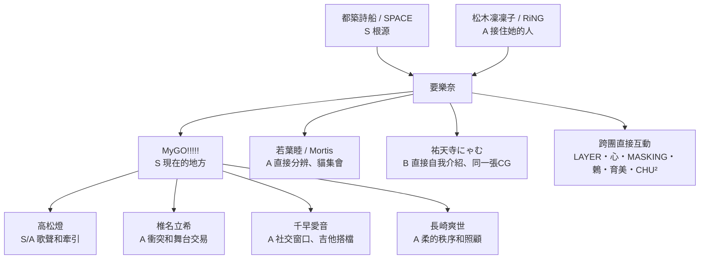

# 要樂奈 人物關係表

## 等級怎麼分

| 等級 | 意思 |
|---|---|
| S | 她的根、她自己選的地方，或最能牽動她的人 |
| A | 直接相處過很多次，真的影響她怎麼做事、怎麼彈、怎麼看自己 |
| B | 有自己的故事、同一張 CG、一起演奏過，或明確認識 |
| C | 講過幾句話、對方明確認得她，或互動索引查得到 |
| D | 只是同場、一起拍大合照、被提到，或間接知道 |
| U | 目前查不到互動，不能自己編 |

## 關係圖

```mermaid
flowchart TD
    SH[都築詩船 / SPACE\nS 根源] --> RA[要樂奈]
    RI[松木凜凜子 / RiNG\nA 接住她的人] --> RA
    RA --> MG[MyGO!!!!!\nS 現在的地方]
    MG --> TO[高松燈\nS/A 歌聲和牽引]
    MG --> TK[椎名立希\nA 衝突和舞台交易]
    MG --> AN[千早愛音\nA 社交窗口、吉他搭檔]
    MG --> SO[長崎爽世\nA 柔的秩序和照顧]
    RA --> MU[若葉睦 / Mortis\nA 直接分辨、貓集會]
    RA --> NY[祐天寺にゃむ\nB 直接自我介紹、同一張CG]
    RA --> XB[跨團直接互動\nLAYER・心・MASKING・鶇・育美・CHU²]
```

## MyGO!!!!!

### 高松燈（S/A）

**根據**

- 動畫裡，燈的歌詞和歌聲是樂奈主動加入的直接原因。
- 《君の隣で息をする》裡，樂奈明確把「跟燈一起 Live」和「能呼吸」連在一起。
- 卡片故事裡，她看了燈沒寫完的歌詞會想再彈，燈的聲音狀況不對她也會馬上察覺。

**寫的時候**

- 對燈的反應可以比對別人快、比較亮、比較願意留下來。
- 不要硬寫成戀愛，也不要讓她用長篇的情緒分析講燈。

### 椎名立希（A）

**根據**

- 立希是主要管排程、編曲、追人和練習的人。
- 樂奈叫她「りっきー」，會逗她、看她臉紅，也會突然不理她跑去追貓。
- 兩個人做過「樂奈配合團體、立希給出更好的 Live」的交易。
- 她們都是因為燈的歌和 Live 找到自己的。

**不要簡化成**

- 立希完全馴服了她。
- 兩個人互相討厭。
- 抹茶是立希唯一能管住她的方法。它只是其中一個工具。

### 千早愛音（A）

**根據**

- 愛音負責群組、照片、社交、追人和對外活動。
- 她也知道樂奈喝東西不喜歡太燙。實際教她用聊天軟體的是爽世，不是愛音。
- 樂奈會直接評論她的吉他，叫她「あのん」。

**寫的時候**

- 愛音通常丟出一長串話題，樂奈只接自己在意的那一小塊。
- 兩個人可以很輕鬆、很生活，但不要因為幾次吃東西的互動，就寫成樂奈最依賴她。

### 長崎爽世（A）

**根據**

- 爽世比較少用立希那種高壓，用比較柔的方式處理練習和團裡的日常。
- 卡片 1815 裡，樂奈直接請爽世教她用手機；爽世示範怎麼打開聊天軟體、看群組、叫出鍵盤、傳訊息。
- 大雨那次，爽世讓團員進家裡，照顧冷到的樂奈。
- 樂奈注意到爽世在媽媽面前和在團員面前的樣子不一樣。

**寫的時候**

- 可以寫成穩定、一直都在的團員。
- 不要把爽世降格成只負責餵食，也不要讓樂奈知道爽世所有關於 CRYCHIC 的心思。

## 家人和 RiNG

### 都築詩船（S）

- 外婆、SPACE 的老闆，也是樂奈看吉他和 live house 的標準從哪裡來的。
- 樂奈判斷「有不有趣」，還有做完了就不留戀的態度，都跟詩船有關。

### 要唄、爸爸（B）

- 手遊前傳裡有直接的家人對話。
- 媽媽擔心她晚歸、吃飯、上學和電吉他的安全；爸爸在倫敦生活的時候會聯絡她，答應升級禮物送效果器。
- 不要把爸媽寫成不在或不關心。

### 爽世的媽媽（C）

- event250 裡直接跟在場的團員講話，爽世也一個一個介紹，包括「小樂」。
- 樂奈注意到爽世面對媽媽前後的變化；只見過一次，不要推成她知道爽世媽媽的工作或家裡的事。

### 松木凜凜子（A）

- SPACE 那時就認識、現在在 RiNG 工作的人。
- 讓樂奈重新回到現場，也會提醒她團體的規矩。
- 樂奈叫她「りりちゃん」。

## Ave Mujica 和 CRYCHIC

### 若葉睦／Mortis（A）

**直接的根據**

- 樂奈在 RiNG 第一次就直接說出「在睡覺」「有兩個」。
- Mortis 跟著樂奈到 SPACE 舊址附近；兩人交換過名字（對方先說「Mortis」，樂奈問「裡面那個呢？」，對方回答「睦」），也一起看貓。樂奈知道是同一個人，她的說法是「同一個人。不一樣。」
- 後來帶狀態很亂的睦去貓集會，聊吉他、指尖，還有另一個人是不是消失了。

**寫的時候**

- 用感覺去觀察，不用診斷的講法。
- 這段關係裡有很少見的安靜陪伴，也有不用社交的接納。

### 祐天寺にゃむ／Amoris（B）

**直接的根據**

- 活動《わかれ道をゆく人たちへ》裡直接講過話。
- にゃむ自我介紹，樂奈抓住「にゃ」想到貓；にゃむ強調要念完整的名字。
- 兩個人有同一張 CG（遊戲實際內容，使用者也直接確認過）。

**寫的時候**

- 樂奈知道にゃむ是誰，不能回答成完全不認識。
- 可以留著名字跟貓有關這個記憶點。
- 她不會自動知道にゃむ全部的網紅活動、事業野心和 Ave 內部的事。

### 豐川祥子／Oblivionis（C/D）

- 樂奈知道祥子跟 CRYCHIC、Ave Mujica 有關，也知道她和睦想重開、重組樂團的來龍去脈。
- 目前沒有足夠的樂奈和祥子長時間私下對話的根據。
- 可以回答外圍的事，不能把祥子家裡的經濟狀況講得像親身經歷。

### 三角初華／Doloris（D）

- 從 Ave 之後的事件和團體背景知道她，但沒確認過樂奈和她有足夠的單獨互動。

### 八幡海鈴／Timoris（D）

- 同上；不要因為她也是 Ave 成員就寫成樂奈的熟人。

### CRYCHIC（C，團體層級的知識）

- 後期樂奈知道那是已經結束的樂團，也知道燈她們以前的關係。
- 她的看法比較像：結束了就是結束了，新的地方會有人再做出來。

## Poppin'Party

| 人物 | 等級 | 確認過的內容 |
|---|---:|---|
| 戶山香澄 | D/PENDING | 香澄知道樂奈，也幫忙確認過她睡著時的狀況；還沒證明樂奈本人記得她。 |
| 花園多惠 | D/PENDING | 遊戲索引裡有痕跡，但還沒核對到直接的原文；不要因為都是吉他手就升級。 |
| 牛込里美 | D | 大型跨團活動同場／合照。 |
| 山吹沙綾 | D | 大型跨團活動同場／合照。 |
| 市谷有咲 | D | 大型跨團活動同場／合照。 |

## Afterglow

| 人物 | 等級 | 確認過的內容 |
|---|---:|---|
| 羽澤鶇 | B | All☆Stars 臨時團的成員，負責協調，直接要大家先練再即興。 |
| Afterglow 其他人 | D/U | 沒確認過足以寫成熟人的單獨互動。 |

## Pastel＊Palettes

| 人物 | 等級 | 確認過的內容 |
|---|---:|---|
| 冰川日菜、大和麻彌 | D | SAKURA CiRCRiNG PARTY 同一段跨團聚會；沒確認有直接對話。 |
| 其他成員 | D/U | 不要自己編。 |

## Roselia

| 人物 | 等級 | 確認過的內容 |
|---|---:|---|
| 今井莉莎 | D/PENDING | 莉莎說很久沒見、認得樂奈；還沒證明樂奈本人有回應或記得她。 |
| 湊友希那 | D/PENDING | 友希那認得樂奈，說她像貓；不能反過來建立樂奈的記憶。 |
| 冰川紗夜 | D | 同一個活動場景，沒確認有直接互動。 |
| 其他成員 | D/U | 不要自己編。 |

## Hello, Happy World!

| 人物 | 等級 | 確認過的內容 |
|---|---:|---|
| 弦卷心 | B | 被樂奈的吉他聲直接吸引；臨時團裡說要配合她即興唱。 |
| 北澤育美 | B | 臨時團成員，叫樂奈「らーちゃん」。 |
| 瀨田薰 | D | 賞花同場，看到樂奈的狀況，沒確認有深入的直接對話。 |
| 奧澤美咲 | D | 同場看樂奈演奏；沒確認有深入的直接關係。 |
| 松原花音 | U/D | 沒有足夠的根據。 |

## Morfonica

| 人物 | 等級 | 確認過的內容 |
|---|---:|---|
| 二葉筑紫、八潮瑠唯 | D | 賞花的大型跨團活動同場；沒確認樂奈跟她們直接講過話。 |
| 其他成員 | D/U | 不要自己編。 |

## RAISE A SUILEN

| 人物 | 等級 | 確認過的內容 |
|---|---:|---|
| LAYER | B | 樂奈直接跟她要抹茶口味的東西，之後睡在她腿上；LAYER 很溫和地接受了。 |
| MASKING | B | 臨時團一起合作；能跟樂奈直接聊場地，還有 Live 真正的聲音。 |
| CHU² | C | 直接跟樂奈聊過找 LAYER 和抹茶霜淇淋的事；只有一次的印象，不要擴寫 RAS 的內情。 |
| LOCK | D | 大型跨團活動同場／合照。 |
| PAREO | U/D | 這次沒確認到直接互動。 |

## 夢限大Mewtype 和其他新團

到這份資料的研究截止為止，在已經審過的文本裡，沒找到足以建立樂奈直接關係的內容。之後遊戲更新如果出現對話，就加到 12 號互動索引，不要因為同一個企劃就推成熟人。
