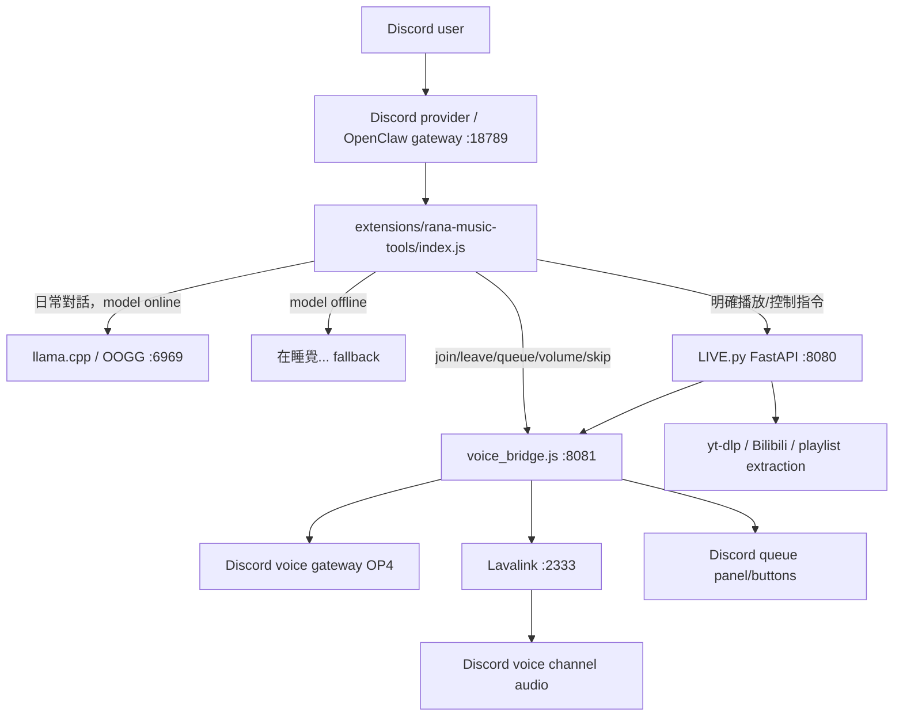

# Rana Voice Orchestration Brain

用途：給 Codex / GPT Chat / OpenClaw 交接目前 Rana voice/music orchestration 狀態。這份不是 runtime 設定檔，不應由服務直接載入。

目前沒有在 `.openclaw`、桌面、`D:\_Project` 的常見路徑找到原本名為 `project_brain` 的檔案；本檔先依現有 repo 與 runtime 檔案整理成可接續版本。

## 核心結論

Rana 只有一個 Discord bot。音樂播放只是 OpenClaw agent 的一種工具能力，不應再新增第二個專門音樂 bot。

正確目標：

- 日常對話走 OpenClaw + local model。
- 明確工具意圖才走工具。
- voice/music 工具要快、穩、少誤觸。
- model 離線時，日常對話回 `在睡覺...`，不要假裝有 LLM 思考。
- 裸名詞、角色名、樂團名是對話內容，不是播放指令。

## Runtime 拓樸



## 主要元件

### OpenClaw Gateway

檔案：

- `openclaw.json`
- `agents/main/agent/models.json`
- `workspace/*.md`

責任：

- Discord provider 接收訊息。
- 載入 Rana workspace markdown personality。
- 呼叫 local model 或 extension tools。
- 維持 channel session。

重要狀態：

- llama-cpp/OOGG `contextWindow` 目前 32768。
- OOGG `maxTokens` 應維持小輸出上限，例如 2048；這不是 context 大小。
- compaction reserve 目前用於避免 session 滿掉，但 reserve 太高會壓縮有效 prompt 空間，需要監控。

敏感事項：

- `openclaw.json` 內含 Discord token，不要貼到聊天或交接文件。

### rana-music-tools extension

檔案：

- `extensions/rana-music-tools/index.js`

責任：

- OpenClaw message hook。
- 判斷是否是工具意圖。
- 明確音樂指令轉給 `LIVE.py`。
- queue/skip/volume/join/leave 轉給 `voice_bridge.js`。
- model 健康檢查。
- `NO_REPLY`、context overflow、假播放句清洗。

目前策略：

- `before_dispatch` 優先攔截明確控制指令。
- 明確播放指令才播放。
- 裸 URL 可播放；裸關鍵字必須伴隨播放語意。
- `CRYCHIC`、`MyGO!!!!!`、`Ave Mujica`、`RiNG` 等 protected bare nouns 不應觸發播放。
- model online 時，一般提及 Rana 的對話應交給 model。
- model offline 時，直接回 `在睡覺...`。

風險：

- 檔案內有部分字串在 PowerShell 讀取時呈現亂碼，需確認檔案本身 UTF-8 與 runtime 實際輸出。
- 過度 hardcode 的 tone sanitizer 可能讓 Rana 回覆變死板。
- fast path 太寬會讓名詞被當成播放；太窄會讓播放關鍵字失效。

### LIVE.py music core

檔案：

- `workspace/services/music_core/LIVE.py`

責任：

- `/api/play` 接收播放請求。
- yt-dlp 擷取 YouTube/Bilibili/playlist。
- Bilibili media proxy。
- playlist 展開與限制。
- 將可播放 tracks 送到 `voice_bridge.js`。

重要規則：

- `PlayResponse.duration` 可接受 float，避免 Bilibili `282.048` 類型錯誤。
- protected bare nouns 必須在沒有 URL 的情況下拒絕播放。
- Bilibili 若需要 headers，改由 local media proxy 提供。
- playlist limit 預設 25，避免一次灌爆 queue。

常見錯誤：

- yt-dlp `Extraction OK but playback failed`：通常是 stream URL/headers/proxy 或 Lavalink 播放層。
- Bilibili API 可能反爬，關鍵字搜尋需要 fallback 或明確 URL。
- bare keyword 如果沒有播放詞，不應進 `/api/play`。

### voice_bridge.js

檔案：

- `workspace/services/music_core/voice_bridge.js`

責任：

- discord.js client 連 Discord voice gateway。
- OP4 join/leave。
- 收 `VOICE_STATE_UPDATE` + `VOICE_SERVER_UPDATE`。
- 將完整 voice credentials PATCH 給 Lavalink。
- 管理 queue/current track/stay voice/volume。
- Discord queue panel/button interactions。
- 處理 Lavalink 4006 voice reconnect。

重要設計：

- Rana 播完歌後應留在語音頻道，直到明確 `離開`。
- `stop` 是停止播放但保留 VC。
- `leave` 才離開 VC。
- same channel 且 voice credentials 完整時不應重連。
- same channel 但 credentials 缺失時會重新握手，可能看起來像 leave/join。
- 4006 時應刷新 voice credentials，不換歌、不清 queue。

風險：

- Discord session state 一旦遺失，重新播放可能觸發可見重連。
- queue panel button 可能 stale，需處理 "component no longer valid" 類型體驗。
- queue panel 文字與按鈕需要維持 zh-TW 且不要亂碼。

### Lavalink

檔案：

- `application.yml`

責任：

- 實際音訊傳輸與音訊 filter。
- 接收 voice_bridge 的 player PATCH。

目前重點：

- bind `127.0.0.1:2333`。
- password 不應外流。
- bufferDurationMs/frameBufferDurationMs 已調低以降低延遲。
- YouTube playlist load limit 100，但 LIVE.py 仍應控制實際匯入上限。

### Boot Process

檔案：

- `start_rana_full.cmd`
- `start LIVE.cmd`
- `gateway_visible.ps1`
- `hot_tools_visible.ps1`

目前 whole-process 概念：

- 檢查 2333/8081/8080，必要時開音樂 stack。
- 檢查 18789，必要時開 OpenClaw gateway。
- 檢查 8091，必要時開 hot tools。
- 每個服務用可見 PowerShell/cmd 視窗，方便睡覺後回來看 log。

## Intent Policy

### 應該交給 model 的情況

- 一般聊天。
- 角色/樂團/世界觀名詞，例如 `CRYCHIC 是什麼？`、`愛音是誰？`。
- 抹茶、貓、日常、情緒、音樂感想。
- 使用者只是提到 YouTube/Bilibili/股票，沒有明確要求查詢或播放。

### 應該走音樂工具的情況

需要明確播放或控制語意：

- `播放 <URL>`
- `播 <關鍵字>`
- `B站 播 咕咕嘎嘎`
- `Rana 進來我這個頻道`
- `離開這個頻道`
- `跳過`
- `跳過 <歌名>`
- `現在播什麼`
- `歌單`
- `音量 35`
- `大聲一點`

### 不應走音樂工具的情況

- `CRYCHIC`
- `MyGO!!!!!`
- `Ave Mujica`
- `RiNG`
- `爽世說要買抹茶蛋糕`
- `YouTube 好多廣告`
- `B站今天怪怪的`

### 股票工具

股票分析應明確要求才調用：

- `美股 CIEN 分析`
- `掃科技股`
- `CIEN GLW ORCL 預測`
- `找進場點`

不應因普通聊天或代號樣式文字自動查股票。

## Known Good Invariants

- Single Discord bot only。
- No extra music bot。
- Voice stack = LIVE.py + voice_bridge.js + Lavalink。
- Rana persona 不應被改成客服 bot。
- Discord text natural reply 主體使用繁體中文。
- 音樂工具回覆也要 zh-TW。
- `NO_REPLY` 永遠不能露給使用者。
- LLM 離線時一般聊天回 `在睡覺...`。
- context overflow 內部訊息不能原樣丟到 Discord。
- playlist 不應覆蓋目前歌曲，應 enqueue。
- 新增點歌不應 auto skip current。
- 播完不自動離開 VC。
- stop 不等於 leave。

## 已處理過的問題紀錄

- Bilibili duration float validation error。
- Bilibili stream headers/proxy。
- YouTube playlist 展開與 enqueue。
- voice 4006 reconnect。
- 播完自動離開 VC。
- 播新歌時 leave/join 重置 session。
- queue UI 按鈕失效與位置調整。
- `NO_REPLY` 外洩。
- model offline 時錯回 `LLM 沒資料`。
- `CRYCHIC` 裸名詞誤觸播放。
- context limit exceeded 訊息外洩。
- Rana 回覆太客服、太 AI、太固定模板。

## 仍需注意的問題

P0:

- 若 token/password 被貼進文件或聊天，必須視為洩漏處理。
- 若 fast path 又放寬，名詞可能再次誤觸播放。
- 若 model offline fallback 被拔掉，Rana 會假裝思考或輸出怪錯誤。

P1:

- `rana-music-tools/index.js` 同時負責 routing、tone sanitize、hot tools、music dispatch，耦合偏高。
- voice state 遺失時會做重新握手，可能造成 visible reconnect。
- queue panel state 與 Discord component lifecycle 需要更穩的 stale handling。
- tone sanitizer 應避免過度固定成只會 `無聊`。

P2:

- 可加一份 Discord UI acceptance test checklist。
- 可把 protected bare nouns 與 tool intent keyword 外移成 markdown/json rules，但不要急著重構。
- 可建立 `voice_orchestration_decisions.md` 記錄每次修 voice 的原因。

P3:

- 清理舊 session/log/cache 前要先確認用途與儲存壓力。
- README/Release docs 可整理 port map、boot command、故障排查。

## Voice Orchestration 測試清單

日常/model：

- `@樂奈 CRYCHIC 是什麼？` 應走 model，不播放。
- `@樂奈 爽世說要買抹茶蛋糕` 應走 model，回覆要理解爽世是主詞。
- `@樂奈 洗碗` 應短回，不露 `NO_REPLY`。
- model offline 時 `@樂奈 LLM` 應回 `在睡覺...` 類短句。

播放：

- `@樂奈 播放 https://www.youtube.com/watch?v=...`
- `@樂奈 播放 meow meow nigga`
- `@樂奈 B站 播 咕咕嘎嘎`
- `@樂奈 播放 <playlist url>` 應 enqueue，多首不覆蓋 current。

控制：

- `@樂奈 歌單`
- `@樂奈 現在播什麼`
- `@樂奈 下一首是什麼`
- `@樂奈 跳過`
- `@樂奈 跳過 <歌名>`
- `@樂奈 小聲`
- `@樂奈 大聲`
- `@樂奈 音量 35`
- `@樂奈 進來我這個頻道`
- `@樂奈 離開這個頻道`

股票：

- `@樂奈 美股 CIEN 分析`
- `@樂奈 CIEN GLW ORCL 預測`
- `@樂奈 掃科技股`

## GPT Chat 整理用 Prompt

把以下內容貼給 GPT Chat 時可用：

```text
你是 Rana AI Agent 專案的技術整理助手。請根據這份 voice orchestration brain，把資訊整理成：

1. 一頁式架構總覽
2. runtime data flow
3. tool intent policy
4. voice/music lifecycle
5. bug history and current risk
6. acceptance test checklist
7. minimal-diff improvement plan

限制：
- 不要引入第二個 Discord bot。
- 不要假設可以重構 OpenClaw runtime。
- 音樂是 Rana 的工具能力，不是獨立 bot。
- 日常對話必須 model-first；工具只在明確意圖時觸發。
- 裸名詞和 lore 名詞不能觸發播放。
- 輸出繁體中文。
- 不要輸出或猜測任何 token/password。

請用工程交接文件格式，不要寫成行銷 README。
```

## 下一步建議

1. 用 Discord UI 跑一次上面的 acceptance checklist。
2. 如果誤觸播放，先修 `extensions/rana-music-tools/index.js` 的 intent gate，不動 `LIVE.py`。
3. 如果播放抽取成功但無聲，先查 `voice_bridge.js` + Lavalink log。
4. 如果 Bilibili 失敗，先確認是搜尋、抽取、proxy、Lavalink 哪一層。
5. 如果 Rana 回覆像 AI 或客服，先修 workspace markdown 和 sanitizer，不碰 voice pipeline。
