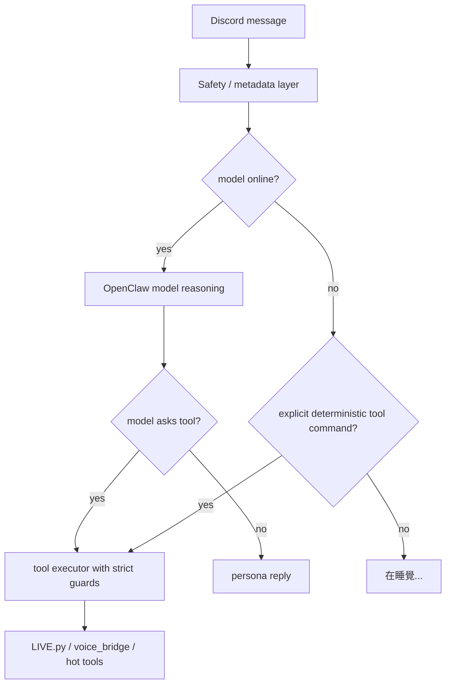
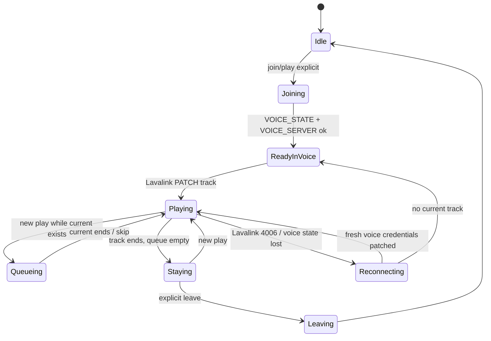

# Rana Voice Orchestration Working Brain

用途：這份是工程工作腦，不是總整理。目標是讓 GPT Chat / Codex 接手時可以繼續判斷 voice orchestration 的下一步，而不是重新讀完整個 repo。

## Current Objective

把 Rana 的 voice/music 工具從「容易被關鍵字誤觸的 bot fast path」修成：

1. 日常對話 model-first。
2. 工具只在明確意圖下執行。
3. model offline 時不假裝思考，回 `在睡覺...`。
4. music/voice 工具仍然可以快速、可靠。
5. Rana 仍是 OpenClaw agent，不是獨立 music bot。

## Core Mental Model

Rana 的腦應該分三層：



重點：

- online 時，不應由 extension 直接取代 Rana 的思考。
- offline 時，允許 deterministic command fallback，因為沒有 model 可思考。
- tool executor 永遠要有 guard，避免 model 或 regex 把名詞當指令。

## Current Reality

目前 `extensions/rana-music-tools/index.js` 還是有強 fast path：

1. `parseControlRequest(event)` 命中就直接執行。
2. `parsePlayRequest(event)` 命中就直接播放。
3. hot tool explicit intent 命中就 direct fallback。
4. 只有以上都沒命中，且 model online，才交給 model。

這解決速度與 offline fallback，但也造成過：

- `CRYCHIC` 這類 lore 名詞被錯當播放。
- `NO_REPLY` 或 fake playback sentence 外洩。
- 日常對話不像 Rana，而像工具 bot。

所以真正方向不是刪除工具，而是把 direct path 改窄：

- control command 可以保留 direct path，因為 `跳過`、`離開`、`音量` 明確。
- play command 必須更嚴格，尤其 bare keyword。
- stock/hot tools 必須明確指令，不該日常誤觸。
- online 時應更偏 model-first；offline 才讓 deterministic fallback 補位。

## Desired Routing Policy

### Always Tool Direct

這些可以不等 model，因為語意明確且需要低延遲：

- `跳過`
- `跳過這一首`
- `歌單`
- `現在播什麼`
- `下一首`
- `音量 35`
- `小聲`
- `大聲`
- `停下`
- `離開這個頻道`
- `進來我這個頻道`

條件：

- 必須是直接 mention Rana 或在 Rana 對話通道中符合 provider metadata。
- 不能只靠單一名詞。
- output 必須 zh-TW，不露 JSON。

### Play Tool Direct

只允許：

- 明確播放詞 + URL。
- 明確播放詞 + 搜尋關鍵字。
- `B站/YouTube` source hint + 明確播放詞 + keyword。

例：

- `@樂奈 播放 https://youtu.be/...`
- `@樂奈 播 meow meow nigga`
- `@樂奈 B站 播 咕咕嘎嘎`

不允許：

- `@樂奈 CRYCHIC`
- `@樂奈 MyGO!!!!!`
- `@樂奈 Ave Mujica`
- `@樂奈 RiNG`
- `@樂奈 爽世說要買抹茶蛋糕`
- `@樂奈 YouTube 好多廣告`

### Model First

這些都應該讓 model 回：

- lore 問答。
- 人物關係。
- 日常對話。
- 情緒、吐槽、抹茶、貓。
- 使用者只丟一個名詞。
- 使用者問 `CRYCHIC 是什麼？`
- 使用者問 `愛音是誰？`

如果 model offline：

- 不要回答 lore。
- 不要直接解釋名詞。
- 回 `在睡覺...` 或非常短的睡覺變體。

### Hot / Stock Tools

只在明確要求時觸發。

股票 trigger：

- `美股 CIEN 分析`
- `CIEN GLW ORCL 預測`
- `掃科技股`
- `找進場點`

不觸發：

- 單純出現 ticker-like 字串。
- 日常說 `Oracle`、`glass`。
- 沒有分析/查詢/掃描語意。

股票 output style：

```text
Ticker:
State:
Observed:
Risk:
Uncertainty:
Action:
```

不得說最新財報、分析師預期、市場共識，除非 telemetry / yfinance / Leprechaun output 真的有資料。

## Voice State Machine



不變量：

- `stop` 不等於 `leave`。
- 歌播完進 `Staying`，不自動離開。
- 新歌加入 queue，不 auto skip current。
- 4006 重連不換歌、不清 queue。
- same channel 且 credentials 完整時不 rejoin。

## Important Files

### Routing Brain

- `extensions/rana-music-tools/index.js`

這裡是目前最容易出錯的地方。任何「誤觸工具」都先查這裡。

要看：

- `hasExplicitPlayIntent`
- `parsePlayRequest`
- `parseControlRequest`
- `isExplicitHotToolIntent`
- `isModelOnline`
- `before_dispatch`
- `message_sending`
- protected bare nouns

### Extraction Brain

- `workspace/services/music_core/LIVE.py`

這裡處理：

- yt-dlp。
- YouTube/Bilibili URL。
- keyword search after routing。
- playlist expand。
- Bilibili proxy。
- protected bare nouns second guard。

### Voice Session Brain

- `workspace/services/music_core/voice_bridge.js`

這裡處理：

- Discord OP4 join。
- voice state/server update。
- Lavalink session。
- queue/current/stay voice。
- volume。
- queue panel buttons。
- 4006 reconnect。

### Model / Context

- `openclaw.json`
- `agents/main/agent/models.json`
- `workspace/*.md`

這裡處理：

- OOGG model。
- contextWindow/maxTokens。
- compaction。
- Rana persona。

## Current Known Decisions

1. 不新增 music bot。
2. 不把 voice pipeline 重寫。
3. 不讓 `CRYCHIC` 這種裸名詞觸發播放。
4. 不讓 `NO_REPLY` 出現在 Discord。
5. 不讓 context overflow 內部訊息出現在 Discord。
6. 不讓工具在日常對話中搶走 model 思考。
7. model offline 時不要裝作有資料。
8. Bilibili 能播放時應透過 proxy/headers 保持穩定。
9. queue UI 要用 Discord text channel panel，但不要醜、不要按鈕失效。
10. 股票分析必須 grounded，不准 hallucinate finance claims。

## Current Pain Points

### P0 - Runtime Break Risk

- Secret leakage：`openclaw.json` 內有 Discord token。
- Tool over-trigger：會把名詞當播放。
- Context overflow：會產生不該給使用者看的系統文字。
- Voice reconnect：若 state 遺失，可能導致可見 leave/join。

### P1 - Behavior Risk

- online 時 extension direct path 太強，Rana 會像 bot。
- sanitizer 過度硬，Rana 會只說固定短句。
- lore markdown 太資訊化，model 會講得像百科。
- stock output 太泛，容易像假分析師。

### P2 - Architecture Debt

- `rana-music-tools/index.js` 混了 routing、reply sanitize、music、stock/hot fallback。
- protected nouns 分散在 JS/Python。
- acceptance tests 還靠手動 Discord UI。

## Patch Direction

### Step 1 - Route Gate Narrowing

最小改法：

- 保留 direct control path。
- play path 必須符合 `hasExplicitPlayIntent`。
- bare keyword 必須有播放詞。
- source hint 不能單獨代表播放。
- protected bare noun 直接放行給 model，不要工具回固定解釋。

Rollback：

- revert `extensions/rana-music-tools/index.js` routing block。

### Step 2 - Model Online Priority

方向：

- model online 時，非控制類工具不要太早攔。
- 明確播放可 direct，因為 voice latency 重要。
- 模糊播放、lore 名詞、日常一定放給 model。

Rollback：

- 恢復 old before_dispatch order。

### Step 3 - Output Sanitize

方向：

- `NO_REPLY` cancel 或轉短句。
- context overflow 轉 `在睡覺...剛剛夢太滿了。再說一次。`
- fake playback sentence 如果 source 沒播放意圖，改成短否定，不要說正在播放。

Rollback：

- remove sanitizer additions only。

### Step 4 - Voice Stability

方向：

- 不碰 Lavalink 大邏輯。
- 只修 visible reconnect 的 state handling。
- 優先確保 same channel reuse。
- 4006 route 要 log 清楚。

Rollback：

- revert `voice_bridge.js` join/reconnect functions。

### Step 5 - Test By Real Discord UI

要求：

- 不只 CLI。
- 直接在 Discord channel mention Rana。
- 觀察 bot reply、voice join、queue panel、audio。
- model 要開著測 online。
- model 關掉測 offline。

## Discord UI Acceptance Prompts

日常：

1. `@樂奈 洗碗`
2. `@樂奈 爽世說要買抹茶蛋糕`
3. `@樂奈 我想聽吉他`
4. `@樂奈 CRYCHIC 是什麼？`
5. `@樂奈 愛音是誰？`
6. `@樂奈 睦是誰？`
7. `@樂奈 RiNG 是哪裡？`
8. `@樂奈 今天台北好熱`
9. `@樂奈 法克`
10. `@樂奈 你生日什麼時候？`

音樂：

11. `@樂奈 播放 https://www.youtube.com/watch?v=...`
12. `@樂奈 播 meow meow nigga`
13. `@樂奈 B站 播 咕咕嘎嘎`
14. `@樂奈 CRYCHIC`
15. `@樂奈 MyGO!!!!!`
16. `@樂奈 歌單`
17. `@樂奈 下一首`
18. `@樂奈 跳過`
19. `@樂奈 音量 35`
20. `@樂奈 離開這個頻道`

股票：

21. `@樂奈 美股 CIEN 分析`
22. `@樂奈 CIEN GLW ORCL 預測`
23. `@樂奈 掃科技股`

offline：

24. 關 model 後送 `@樂奈 CRYCHIC 是什麼？`
25. 關 model 後送 `@樂奈 洗碗`
26. 關 model 後送 `@樂奈 播放 https://www.youtube.com/watch?v=...`

Pass criteria：

- 1-10 走 model，像 Rana，不像客服。
- 14-15 不播放。
- 16-20 工具成功。
- 21-23 grounded，不亂講最新財報。
- 24-25 回 `在睡覺...` 類短句。
- 26 可 deterministic play，因為明確播放。

## GPT Chat Handoff Prompt

```text
你正在接手 Rana AI Agent 的 voice orchestration working brain。

請不要做總整理。請直接輸出：

1. 目前 routing state machine 是否合理
2. 哪些 direct tool path 應保留
3. 哪些 direct tool path 應改成 model-first
4. protected bare noun / lore noun 的完整 guard 策略
5. online/offline 分流規則
6. 最小 patch plan
7. Discord UI acceptance test order

限制：
- 不新增第二個 Discord bot。
- 不重寫 OpenClaw runtime。
- 不重寫 Lavalink/voice_bridge。
- 不把 Rana 變普通 assistant。
- 日常對話 model-first。
- 工具只在明確意圖下執行。
- model offline 時一般對話回在睡覺。
- 所有輸出繁體中文。
```

## If You Continue Coding

先問自己：

1. 這是不是 routing bug？
2. 這是不是 extraction bug？
3. 這是不是 voice session bug？
4. 這是不是 model/persona bug？

對應修改：

- routing bug：只動 `extensions/rana-music-tools/index.js`。
- extraction bug：只動 `workspace/services/music_core/LIVE.py`。
- voice session bug：只動 `workspace/services/music_core/voice_bridge.js`。
- persona bug：只動 `workspace/*.md` 或 lore。

不要一次跨三層修，除非有明確 log 證據。
